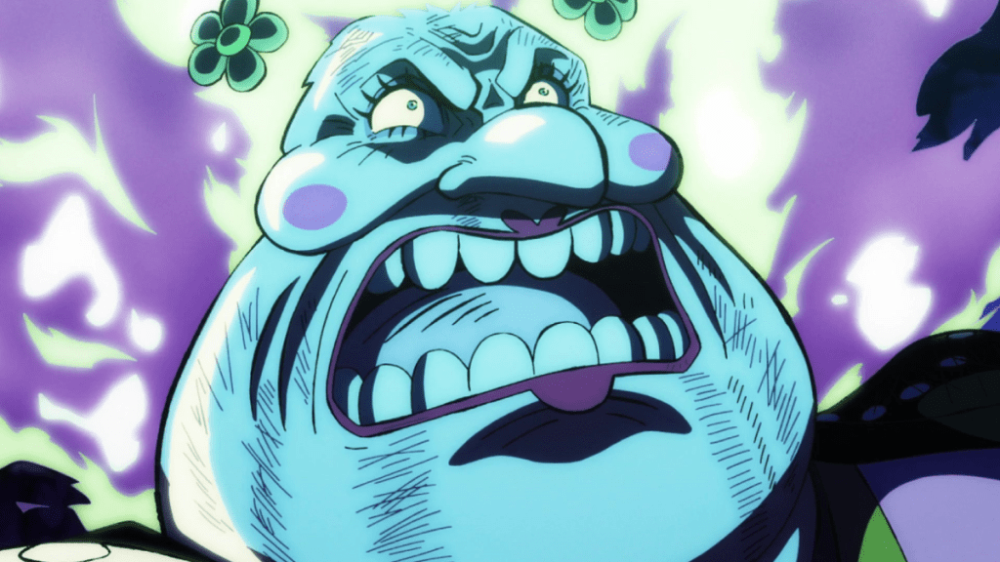

# Life-or-Death

"Life is a one-time journey for each individual, and everyone should cherish it. However, there are moments when the question of 'life or death' becomes a real consideration."

Presented here is an occasional account of instances where lives have been abruptly cut short. It may not align with everyone's preferences, but for those of sound mind who peruse these records, a sense of sorrow may arise. It shouldn't have unfolded in this manner. What led to the premature end of their lives? 
